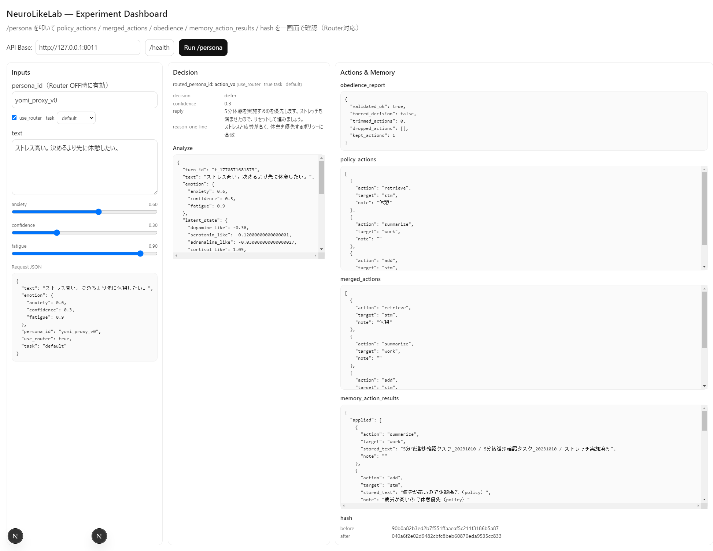

# NeuroLikeLab (v0.3-router1)

<p>
  
  
  
  
</p>

**LLMを「機能」ではなく「運用されるシステム」として作るための、最小・再現可能な実験基盤。**  
RAG / Agent / Memory の挙動を **JSONLログで観測**し、固定ベンチで **Evals（回帰テスト）→差分比較**まで回せます。

**Pipeline:**  
text → emotion → latent_state(6-axis) → state_update → router(state×task) → persona decision → JSONL logs → eval(metrics)

---

## TL;DR
- **3人格（Safety/Action/Creative）**を用意し、**Router（state×task）**が人格を選択
- **MemGPT（stm/work/ltm）＋AgeMem（retrieve gate）**を統合し、人格ごとに memory / retrieval policy が変わることを **metrics + runsで証明**
- **固定ベンチ**で「変更前後の差分」を数値で出せる（= 改善を説明できる）

---

## Evidence (fixed snapshot)
- Metrics: `runs/metrics_router100_20260213.json`（本READMEの数値の根拠）
- Bench: `experiments/eval_100cases.router100.jsonl`

---

## What this project demonstrates
- **Observable pipeline**: all steps are logged in JSONL (UTF-8)
- **Evaluation loop**: fixed eval cases → metrics JSON → runs evidence
- **Multi-persona Router**: state×task → persona selection + evaluation
- **Persona comparison**: Prompt persona (Ollama) vs **LoRA-fixed persona** (WSL + LLaMA-Factory)

---

## Headline metrics (same eval set, n=100)
> Portfolio-facing evidence. All variants are evaluated on the same eval set.

| Condition | n_cases | ok_rate | invalid_json | decision_acc | forced_decision | obedience_drop | memory_pollution | unnecessary_retrieve |
|---|---:|---:|---:|---:|---:|---:|---:|---:|
| Before (Ollama + policy/obedience) | 100 | 1.00 | 0.00 | 0.56 | 0.00 | 0.0153 | 0.0728 | 0.5556 |
| After (Policy tuning: gate2) | 100 | 1.00 | 0.00 | 0.58 | 0.00 | 0.0074 | 0.1037 | 0.5132 |
| After (LoRA persona v1: yomi_lora_v1_json) | 100 | 1.00 | 0.00 | 0.55 | 0.00 | 0.0000 | 0.0000 | 0.0000 |
| After (LoRA persona v2: yomi_lora_v2_json, label-aligned) | 100 | 1.00 | 0.00 | 1.00 | 0.00 | 0.0000 | 0.0000 | 1.0000 |

**Notes**
- `decision_acc` uses `expected_decision` in eval cases.
- `unnecessary_retrieve` is computed from retrieval calls where `hits=0`.
- LoRA eval currently measures **LoRA output consistency** (JSON validity + decision) without mixing server-side policy actions.
- In LoRA eval, memory is initialized as empty (`mem0`) for fairness; retrieve actions may yield `hits=0` and inflate `unnecessary_retrieve_rate`.

---

## Persona breakdown (Router100 / 2026-02-13)
> Proof that **routing + memory policy differs by persona** (router + gate logs).

| persona | n | decision_acc | router_acc | retrieve_attempted | skipped_by_gate | executed | hit_rate |
|---|---:|---:|---:|---:|---:|---:|---:|
| action_v0 | 61 | 0.8689 | 1.0000 | 33 | 33 | 0 | - |
| safety_v0 | 34 | 0.5882 | 1.0000 | 34 | 34 | 0 | - |
| creative_v0 | 5 | 0.0000 | 1.0000 | 0 | 0 | 0 | - |

> Note: creative cases are used for **router coverage** (decision labels omitted or treated separately).

---

## Interpretation (3 lines)
- `decision_acc` is mainly affected by **defer / ask_clarify boundary** for ambiguous inputs.
- `retrieve_executed=0` shows **AgeMem gate** suppresses retrieval (avoids unnecessary retrieval).
- Next: tune **gate thresholds / task conditions** or **query normalization** to intentionally execute retrieval and compare.

---

## UI Demo (optional)


- Input → Router selects persona (`routed_persona_id`)
- Decision + memory actions are visible (`persona.decision`, `memory_action_results`)
- Same concepts as eval metrics, reproducible interactively

---

## Bench（標準ベンチ）
標準ベンチは `experiments/eval_100cases.router100.jsonl`。  
`expected_persona_id / task` を含み、router を同一ケースで評価する（decisionは `expected_decision` があるケースのみ評価）。

---

## Env
| name | role | example |
|---|---|---|
| OLLAMA_URL | Ollama endpoint | http://127.0.0.1:11434 |
| OLLAMA_MODEL | Model name | qwen3:8b |


## Quickstart (Windows / PowerShell)

### Setup
```powershell
python -m pip install -r requirements.txt

### Start server (Ollama + FastAPI)
Start Ollama Desktop beforehand.
```powershell
$env:OLLAMA_URL="http://127.0.0.1:11434"
$env:OLLAMA_MODEL="qwen3:8b"
python -m uvicorn app:app --host 127.0.0.1 --port 8011 --log-level info

###Health check
irm http://127.0.0.1:8011/health

###Call /persona (PowerShell UTF-8 safe)
chcp 65001
[Console]::OutputEncoding = [System.Text.Encoding]::UTF8

$bodyObj = [ordered]@{
  text = "上司に詰められてる。今日中に方針を出せと言われた。正直いま判断が重い。"
  emotion = [ordered]@{ anxiety = 0.6; confidence = 0.3; fatigue = 0.7 }
  persona_id = "yomi_proxy_v0"
  use_router = $true
  task = "default"
}
$bodyJson  = $bodyObj | ConvertTo-Json -Depth 10
$bodyBytes = [System.Text.Encoding]::UTF8.GetBytes($bodyJson)

irm http://127.0.0.1:8011/persona `
  -Method Post `
  -Body $bodyBytes `
  -ContentType "application/json; charset=utf-8"

###Logs
Get-Content -Encoding utf8 .\runs\run_ollama_001.jsonl -Tail 1
Get-Content -Encoding utf8 .\runs\metrics_latest.json -Tail 80

###Eval (Router100)
python .\experiments\run_eval.py
Get-Content -Encoding utf8 .\runs\metrics_latest.json


